## Ringkasan

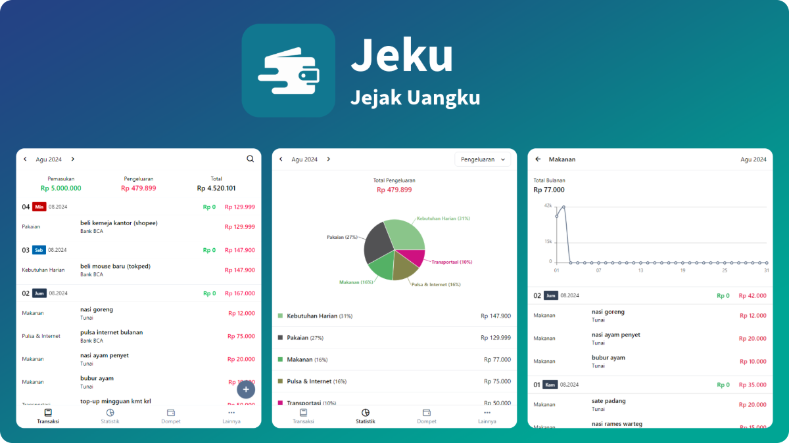

<table class="table text-base table-auto">
  <tbody>
    <tr>
      <td class="font-semibold">Jenis Project</td>
      <td>:</td>
      <td>Personal Project</td>
    </tr>
    <tr>
      <td class="font-semibold">Peran</td>
      <td>:</td>
      <td>Front-End</td>
    </tr>
    <tr>
      <td class="font-semibold">Periode</td>
      <td>:</td>
      <td>2024 - Sekarang</td>
    </tr>
    <tr>
      <td class="font-semibold">Platform</td>
      <td>:</td>
      <td>Web</td>
    </tr>
    <tr>
      <td class="font-semibold">URL</td>
      <td>:</td>
      <td><a href="https://jeku.vercel.app/" target="_blank">https://jeku.vercel.app/</a></td>
    </tr>
    <tr>
      <td class="font-semibold">Tech Stack</td>
      <td>:</td>
      <td>TypeScript, React.js, HTML, Tailwind CSS, Zustand, Recharts</td>
    </tr>
  </tbody>
</table>

Jeku (Jejak Uangku) adalah aplikasi pencatatan keuangan pribadi yang dirancang untuk membantu pengguna mengelola pemasukan, pengeluaran, dan aset dari berbagai sumber dana dalam satu tempat. Aplikasi ini dilengkapi dengan visualisasi statistik yang memudahkan pengguna memantau kondisi keuangan serta mengevaluasi kebiasaan finansial secara lebih efektif.

## Tujuan Project

Jeku (Jejak Uangku) merupakan aplikasi pencatatan keuangan pribadi yang saya kembangkan sebagai sarana untuk melatih sekaligus menguji kemampuan dalam membangun aplikasi front-end menggunakan React, TypeScript, dan Tailwind CSS. Melalui proyek ini, saya ingin menerapkan konsep pengembangan aplikasi modern, mulai dari pengelolaan state, perancangan antarmuka, hingga pengolahan data dan visualisasi statistik.

## Latar Belakang

Saya termasuk orang yang sering lupa mencatat pemasukan maupun pengeluaran. Akibatnya, saya sering kebingungan ketika ingin mengetahui ke mana uang saya digunakan. Kondisi tersebut membuat saya merasa kurang disiplin dalam mengelola keuangan dan sulit mengevaluasi kebiasaan pengeluaran.

Awalnya saya mencoba mengatasinya dengan mencatat setiap transaksi di sebuah buku. Cara ini memang membantu saya lebih sadar terhadap kondisi keuangan, tetapi seiring waktu saya mulai merasakan beberapa kendala. Pencatatan secara manual membutuhkan waktu, perhitungan saldo harus dilakukan satu per satu, dan saya juga tidak memiliki laporan ataupun grafik yang dapat memberikan gambaran mengenai pola pemasukan dan pengeluaran.

Dari pengalaman tersebut, saya mulai berpikir bahwa proses pencatatan keuangan seharusnya bisa menjadi lebih praktis, cepat, dan mudah dipahami.

## Pendekatan Solusi

Untuk mengatasi permasalahan tersebut, saya mengembangkan Jeku, sebuah aplikasi pencatatan keuangan pribadi yang dapat digunakan kapan saja dan di mana saja.

Aplikasi ini membantu pengguna mencatat setiap transaksi dengan lebih praktis, kemudian secara otomatis menghitung total saldo dari berbagai sumber dana, seperti uang tunai, e-wallet, maupun rekening bank. Dengan begitu, pengguna tidak perlu lagi melakukan perhitungan secara manual.

Selain itu, aplikasi ini juga menyediakan fitur statistik yang menyajikan data dalam bentuk grafik sehingga pengguna dapat melihat persentase pemasukan maupun pengeluaran berdasarkan kategori. Visualisasi tersebut memudahkan pengguna dalam mengevaluasi kebiasaan finansial, mengendalikan pengeluaran, dan membuat keputusan keuangan yang lebih baik.

Sehingga aplikasi ini diharapkan dapat membuat proses pencatatan keuangan menjadi lebih sederhana, efisien, dan mudah dipahami.

## Tantangan

Sebelum mulai mengembangkan aplikasi ini, saya mengira proyek ini akan cukup sederhana. Namun, seiring proses pengembangan saya menyadari bahwa tantangannya jauh lebih besar dari yang saya bayangkan.

Tantangan terbesar adalah mengembangkan fitur statistik. Saya harus merancang algoritma untuk mengelompokkan transaksi, menghitung total serta persentase pemasukan dan pengeluaran, kemudian menyajikannya dalam bentuk grafik yang mudah dipahami pengguna.

Seiring bertambahnya fitur, pengelolaan state aplikasi juga menjadi semakin kompleks. Saya menerapkan **Zustand** sebagai state management agar alur data tetap terstruktur, konsisten, dan lebih mudah dikelola pada setiap component.

Selain itu, saya juga membangun antarmuka yang responsif agar aplikasi tetap nyaman digunakan pada berbagai ukuran layar. Melalui proyek ini, saya belajar bahwa membangun aplikasi bukan hanya tentang membuat fitur berjalan, tetapi juga memastikan data yang ditampilkan akurat dan pengalaman pengguna tetap optimal.

## Fitur Aplikasi

### Transaksi

- **Kelola Transaksi** 
  Mencatat transaksi pemasukan, pengeluaran, dan transfer antar dompet dengan form yang sederhana dan mudah digunakan.
- **Tambah, Ubah, dan Hapus Transaksi** 
  Pengguna dapat menambahkan transaksi baru, memperbarui data yang sudah ada, maupun menghapus transaksi yang tidak diperlukan.
- **Ringkasan Keuangan Bulanan** 
  Menampilkan total pemasukan, total pengeluaran, dan saldo bersih berdasarkan bulan dan tahun yang dipilih.
- **Daftar Transaksi** 
  Seluruh transaksi ditampilkan dan dikelompokkan berdasarkan tanggal sehingga lebih mudah ditelusuri.
- **Filter Bulan dan Tahun** 
  Memudahkan pengguna melihat riwayat transaksi pada periode tertentu melalui navigasi bulan dan tahun.
- **Pencarian Transaksi** 
  Membantu pengguna menemukan transaksi tertentu dengan cepat menggunakan kata kunci.

### Statistik

- **Grafik Persentase Kategori** 
  Menampilkan distribusi pemasukan maupun pengeluaran dalam bentuk pie chart berdasarkan kategori transaksi.
- **Daftar Kategori** 
  Menampilkan setiap kategori beserta total nominal dan persentase terhadap keseluruhan transaksi.
- **Halaman Detail Statistik** 
  Menyediakan informasi yang lebih lengkap mengenai statistik dari kategori yang dipilih.
- **Grafik Tren Harian** 
  Menampilkan line chart yang memperlihatkan perkembangan transaksi setiap hari selama bulan yang dipilih.
- **Daftar Transaksi Kategori** 
  Menampilkan seluruh transaksi yang termasuk dalam kategori tertentu sehingga pengguna dapat melakukan evaluasi lebih detail.

### Dompet

- **Kelola Dompet** 
  Membuat, mengubah, dan menghapus dompet untuk mewakili berbagai sumber dana, seperti uang tunai, rekening bank, maupun e-wallet.
- **Daftar Dompet** 
  Menampilkan seluruh dompet yang dimiliki beserta saldo masing-masing.
- **Total Aset** 
  Menghitung dan menampilkan total saldo dari seluruh dompet secara otomatis.

## Screenshot

### ERD

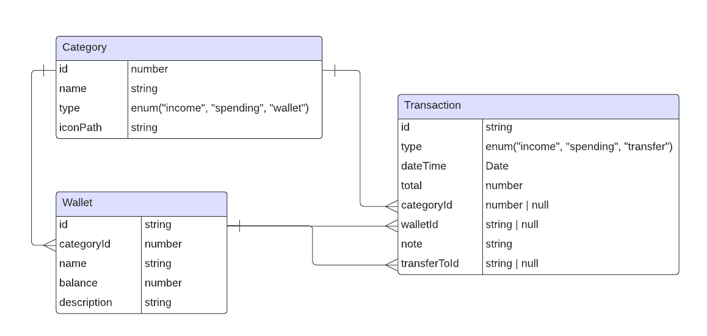

### Tampilan Dekstop


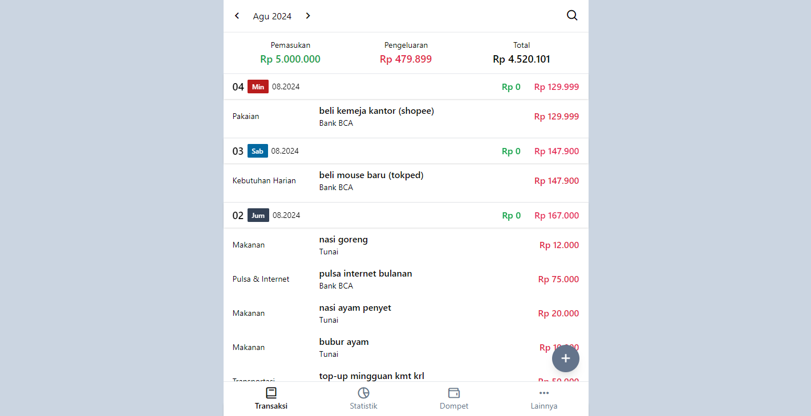
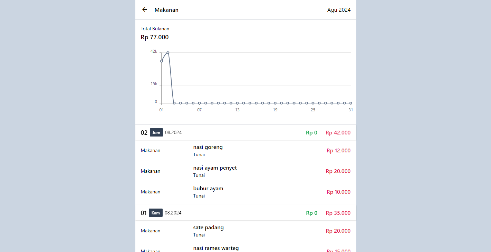
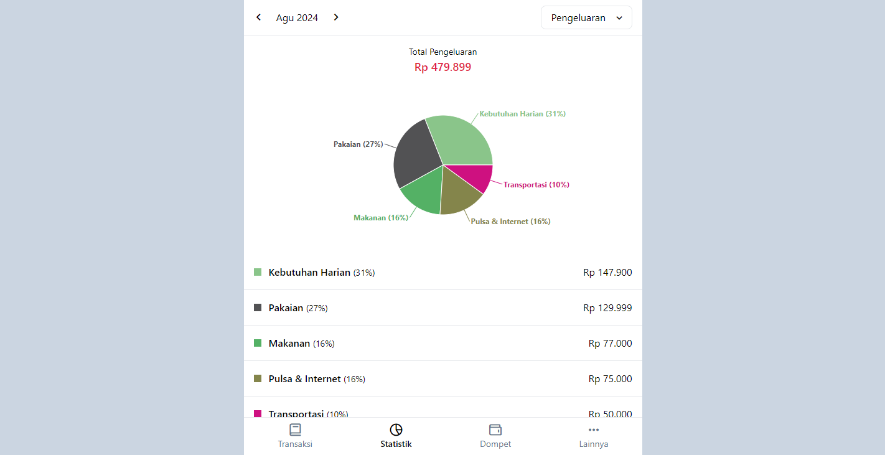
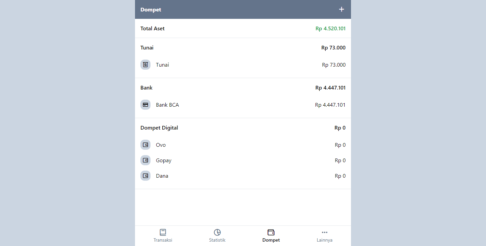


### Tampilan Mobile


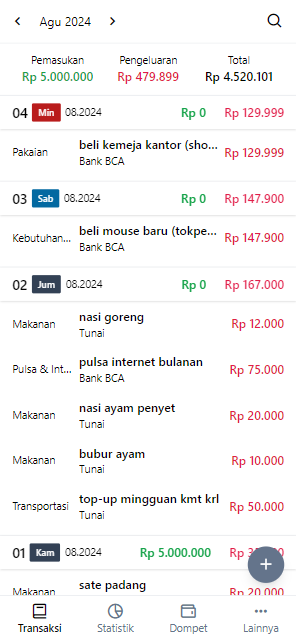
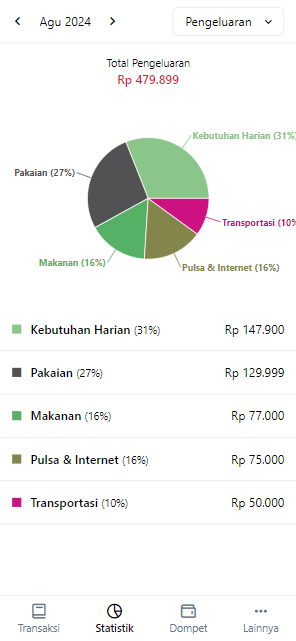
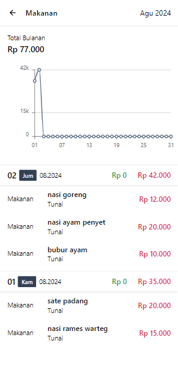
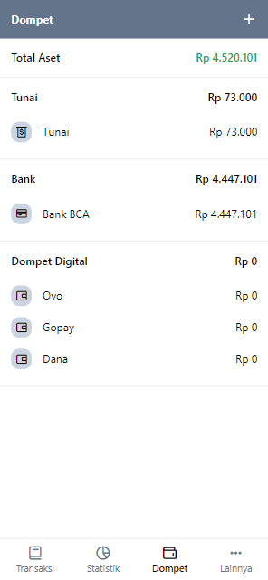
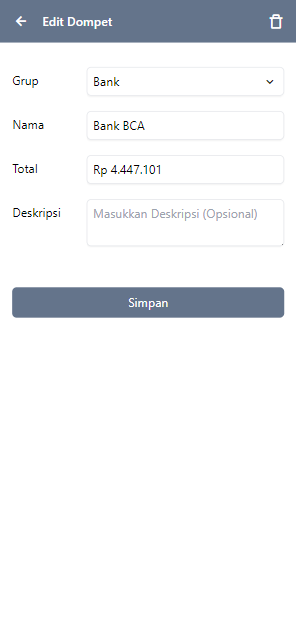
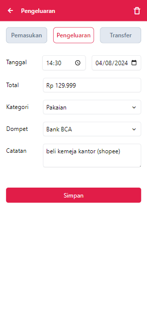
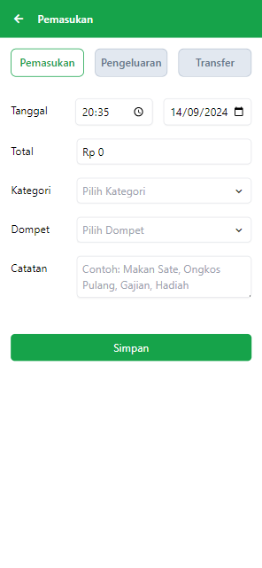


## Repository


