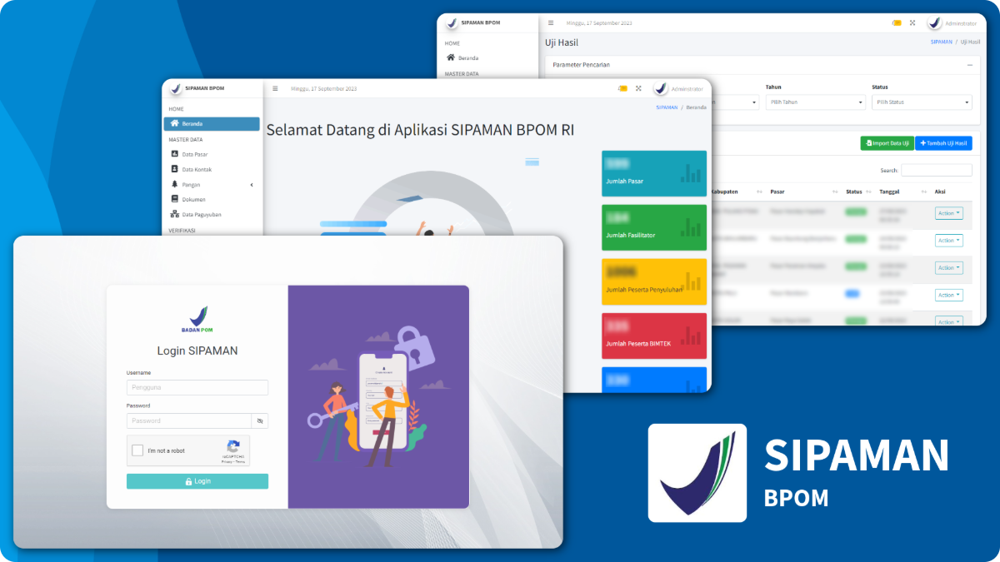
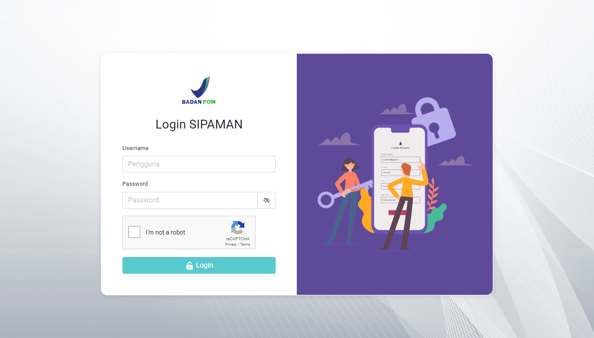
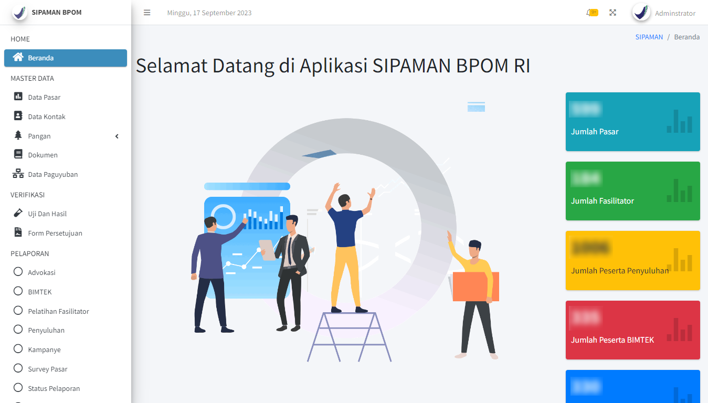
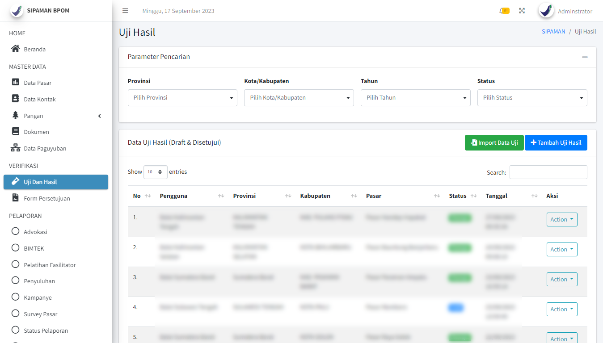
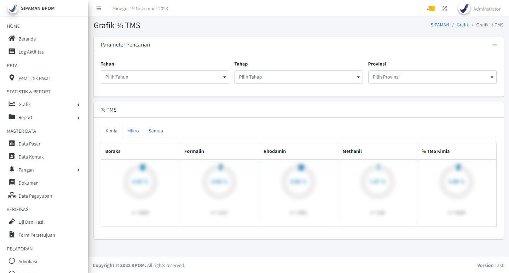

## Ringkasan

<table class="table text-base table-auto">
  <tbody>
    <tr>
      <td class="font-semibold">Instansi</td>
      <td>:</td>
      <td>Badan Pengawas Obat dan Makanan (BPOM)</td>
    </tr>
    <tr>
      <td class="font-semibold">Peran</td>
      <td>:</td>
      <td>Web Developer</td>
    </tr>
    <tr>
      <td class="font-semibold">Periode</td>
      <td>:</td>
      <td>Juli 2022 - Juni 2023</td>
    </tr>
    <tr>
      <td class="font-semibold">Platform</td>
      <td>:</td>
      <td>Web</td>
    </tr>
    <tr>
      <td class="font-semibold">URL</td>
      <td>:</td>
      <td><a href="https://sipaman.pom.go.id/" target="_blank">https://sipaman.pom.go.id/</a></td>
    </tr>
    <tr>
      <td class="font-semibold">Tech Stack</td>
      <td>:</td>
      <td>PHP, Codeigniter 3, MySQL, JavaScript, jQuery, HTML, CSS Bootstrap</td>
    </tr>
  </tbody>
</table>

SIPAMAN (Sistem Informasi Pasar Aman) adalah sebuah aplikasi berbasis web yang digunakan secara aktif oleh Badan Pengawas Obat dan Makanan (BPOM) untuk mendukung program Pasar Pangan Aman. Aplikasi ini membantu proses pemantauan keamanan pangan, pengumpulan data mengenai pola konsumsi masyarakat Indonesia, penilaian indikator keamanan pangan, serta pelaporan kegiatan intervensi pasar pangan aman berbasis komunitas.

## Latar Belakang

Sebelum dilakukan pengembangan ulang, SIPAMAN telah digunakan selama beberapa tahun dengan teknologi berbasis .NET dan Microsoft SQL Server. Seiring berjalannya waktu, aplikasi menghadapi beberapa kendala, seperti performa yang menurun, tampilan antarmuka yang sudah tidak mengikuti standar modern, serta teknologi yang semakin sulit untuk dikembangkan dan dipelihara.

Pada tahun 2022, BPOM melakukan revitalisasi sistem dengan tujuan meningkatkan performa aplikasi, memperbarui teknologi yang digunakan, serta menghadirkan pengalaman penggunaan yang lebih baik bagi pegawai internal. Tim pengembang memutuskan membangun ulang aplikasi menggunakan PHP, CodeIgniter 3 dan MySQL agar lebih mudah dikembangkan, dipelihara, dan sesuai dengan kebutuhan operasional aplikasi.

## Peran dan Tanggung Jawab

Saya bergabung sebagai Web Developer dalam tim yang terdiri dari **1 Project Lead** dan **2 Web Developer** untuk melakukan revitalisasi aplikasi SIPAMAN milik BPOM. Selama proyek berlangsung, saya terlibat dalam proses pengembangan aplikasi, migrasi sistem, pengujian, hingga optimasi performa.

**Tanggung jawab saya meliputi:**

- Melakukan revitalisasi aplikasi dari sistem legacy berbasis .NET menjadi **PHP CodeIgniter 3** dengan database **MySQL**.
- Mengonversi struktur database dari Microsoft SQL Server ke **MySQL** melalui proses mapping dan penyesuaian skema dengan tetap **menjaga integritas data** selama proses migrasi.
- Mengembangkan berbagai fitur baru sesuai kebutuhan pengguna, termasuk modul **Data Master**, **Pelaporan**, **Import & Export Excel**, serta sistem **Manajemen Hak Akses (Role-Based Access Control)**.
- Melakukan perbaikan bug, penyempurnaan fitur, dan optimasi performa aplikasi untuk meningkatkan stabilitas serta pengalaman pengguna.
- Berpartisipasi dalam proses **System Integration Testing (SIT)** dan **User Acceptance Testing (UAT)** hingga aplikasi dinyatakan siap digunakan.

## Hasil

Revitalisasi aplikasi berhasil menggantikan sistem legacy berbasis .NET dengan aplikasi berbasis PHP, CodeIgniter 3 dan database MySQL. Proses migrasi database berjalan dengan tetap menjaga integritas data, sementara berbagai fitur baru berhasil dikembangkan sesuai kebutuhan pengguna.

Selain itu, optimasi yang dilakukan selama proses pengembangan menghasilkan peningkatan performa aplikasi sehingga waktu akses menjadi lebih cepat dan responsif dibandingkan sistem sebelumnya. Aplikasi dinyatakan siap digunakan setelah melalui proses System Integration Testing (SIT) dan User Acceptance Testing (UAT).

## Tantangan

Proyek ini merupakan pengalaman profesional pertama saya setelah lulus kuliah. Selain harus beradaptasi dengan proses pengembangan perangkat lunak dalam tim, saya juga belajar membangun komunikasi yang efektif karena seluruh proyek dikerjakan secara remote.

Seiring proses pengembangan, saya menghadapi tantangan dalam mengembangkan sistem Manajemen Hak Akses (Role-Based Access Control), karena saat itu saya belum pernah mengembangkan fitur serupa. Saya memecah permasalahan menjadi beberapa bagian, mulai dari merancang struktur database, menyusun logika otorisasi, hingga membangun antarmuka pengelolaan hak akses, sehingga fitur dapat diselesaikan sesuai kebutuhan aplikasi.

Selain itu, saya juga menghadapi tantangan dalam mengembangkan validasi data pada fitur Import Excel hingga tingkat sel (cell) dan mengoptimalkan query SQL setelah proses deployment. Kedua tantangan tersebut berhasil diselesaikan sehingga proses impor data menjadi lebih informatif dan performa aplikasi meningkat.

## Screenshot





> Demi menjaga kerahasiaan, saya tidak menampilkan informasi secara detail mengenai fitur-fitur aplikasi.
